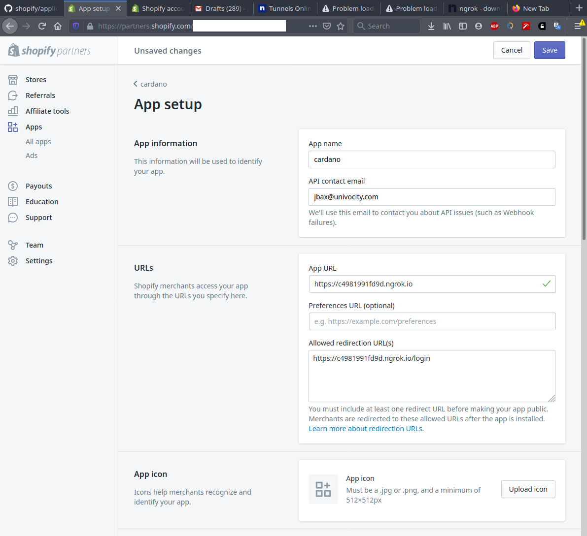

# Testing the app from your desktop

To test the app locally, you need first to install [ngrok](https://ngrok.com/download).
Follow the steps listed in the download page.  

Execute the [Main](https://github.com/uniVocity/shopify/blob/master/src/main/java/com/univocity/shopify/Main.java) 
class to start the local server first. By default it will run on port `8787` but you can
configure this on the [application.properties](https://github.com/uniVocity/shopify/blob/master/src/main/resources/config/application.properties):

```properties
server.port = 8787
```

Then start ngrok using that port: 

```shell script
./ngrok http 8787
```

It will provide the following output with the forwarding addresses:

```
Session Status                online                                                                                                                                               
Account                       your@email.com (Plan: Free)                                                                                                                
Version                       2.3.35                                                                                                                                               
Region                        United States (us)                                                                                                                                   
Web Interface                 http://127.0.0.1:4040                                                                                                                                
Forwarding                    http://c4981991fd9d.ngrok.io -> http://localhost:8787                                                                                                
Forwarding                    https://c4981991fd9d.ngrok.io -> http://localhost:8787
```

Copy the https forwarding address (in the example above, `https://c4981991fd9d.ngrok.io`)
and go to your app setup in shopify, then define the app URLs and redirection URL 
to use that address, then click the "save" button:




