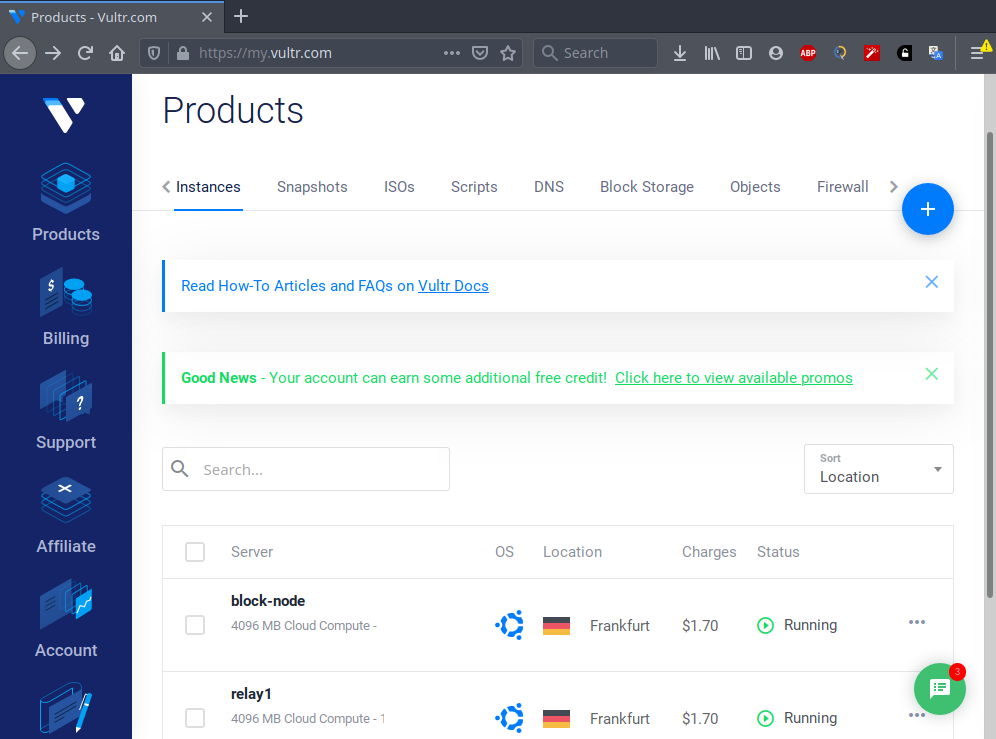
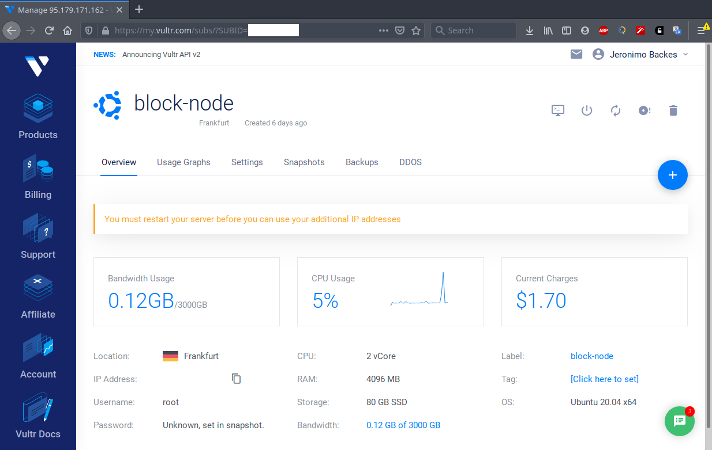

# Setting up the cardano e-commerce app for shopify on your own server.

**This is work in progress with lots of scattered bits and pieces. Don't try following it yet.**

**Go straight to the [web server setup][web_server_setup.md] steps if you are running
this from your desktop.**

This is a step by step guide for setting up the shopify app using [Vultr](https://www.vultr.com/?ref=7304867).

Many of the steps listed below (such as enabling swap and google authenticator) will work 
on pretty much any other VPS or in your own local server, provided it runs Ubuntu Linux.

This guide is written in simple `.md` files. I suggest you to download the `.md` files
and replace all placeholders that exist in the commands presented here.

From your favorite editor, run a Search+Replace and every single command should just work<sup>TM</sup>:
```
# your username in the server
<USER>
# your public (and fixed) IP address
<YOUR_IP_ADDRESS>
```

## Setting up

First create ONE instance on [Vultr](https://www.vultr.com/?ref=7304867). Once 
you create your account, click the "deploy" button. 

Select `Cloud Compute`. The server location is irrelevant.

Server type: `64 bit OS`
Choose: `Ubuntu 20.04 x64`

Select the server size you want (anything will do)

On section "additional features", tick `Enable Private networking`

On section SSH keys, add your SSH key. If you don't have one, follow the vultr guide on [Creating an SSH key on Linux](https://www.vultr.com/docs/how-do-i-generate-ssh-keys/)

Set the server hostname and label to `cardano-app`

Leave everything else untouched.

Click `deploy now` and wait for the instance to be ready.

Once done, the menu "Products" will show you the list of servers, like below:



Click on your server, and copy the IP address. Also take note of
the root password.

 
 
From the terminal on your local desktop, SSH into the server:

```
ssh -A root@<PUBLIC_IP_ADDRESS>
```

Create your user:
```
adduser <USER>

# enable sudo for user
usermod -aG sudo <USER>

# become the new user
su - <USER>
```

Add a SSH key:

```
# run this from your pc. It will install your SSH key in the server
ssh-copy-id <USER>@<YOUR_IP_ADDRESS> 

# Try logging into the server:
ssh -A <USER>@<YOUR_IP_ADDRESS>
```

## Securing your server

We are going to setup google authenticator to make it much harder to get into your server.
I highly recommed it because if someone installs a keylogger on your computer, 
they won't be able to log into your server knowing just your password.

The first step is to disable password authentication:

```
sudo nano /etc/ssh/sshd_config

#Search for the following keys and make sure they have the following values.
PasswordAuthentication no
PubkeyAuthentication yes
ChallengeResponseAuthentication no

#Save and restart the SSH daemon
sudo systemctl reload sshd
```

Open a new terminal and try to login into the server:

```
ssh -A <USER>@<YOUR_IP_ADDRESS>
```

Install google authenticator:
```
sudo apt-get install libpam-google-authenticator
google-authenticator
```


Say yes to everything and save the scratch codes.

```
#Force users to provide login with google auth
sudo nano /etc/pam.d/common-auth

#Add this line to the end of the file
auth required pam_google_authenticator.so

sudo nano /etc/ssh/sshd_config

#Change this line
ChallengeResponseAuthentication yes

#Save and restart
sudo systemctl restart sshd.service
```

Try logging in again from another terminal just to make sure you didn't lock yourself out.
```
ssh -A <USER>@<YOUR_IP_ADDRESS>
```

Then proceed:

```
sudo nano /etc/ssh/sshd_config

#Add the following
UsePAM yes
AuthenticationMethods publickey,keyboard-interactive
```

Finally:

```
sudo nano /etc/pam.d/sshd

#add this line to the top of the file:
auth [success=done new_authtok_reqd=done default=die] pam_google_authenticator.so

#Comment this line by adding a # in front of @include common-auth
#@include common-auth

#Save and restart again.
sudo systemctl restart sshd.service
```

Logging into a new SSH session should now ask for the verification code.

```
ssh -A <USER>@<YOUR_IP_ADDRESS>
```

Lock the root account:

```
 sudo  usermod -p '*' root
```

Install fail2ban to block suspicious IPs

```
sudo apt-get install fail2ban
```

## Private IP setup

Make sure the network interface associated with the private IP is up:

```
ip addr
```

You should see your private IP associated with a network interface.

If you can't find it check the VPS instructions. In Vultr, 
you need create the required configuration, e.g. `/etc/netplan/10-ens7.yaml`, which should contain something like this:

```
network:
  version: 2
  renderer: networkd
  ethernets:
    ens7:
      mtu: 1450
      dhcp4: no
      addresses: [<PRIVATE_IP_ADDRESS>/20]
```

Make sure to set the hostname if it's not correct:

```
sudo nano /etc/hostname
sudo nano /etc/hosts
sudo reboot
```

Once done, restart the server.

