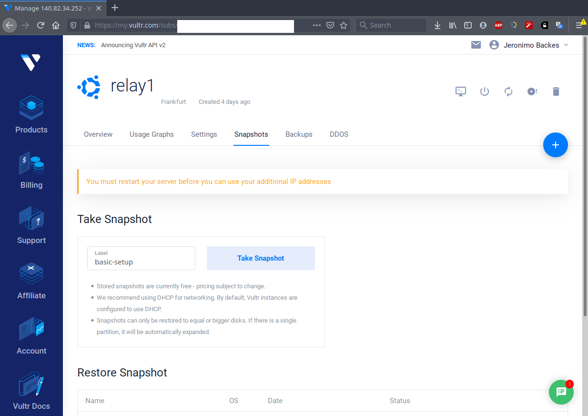
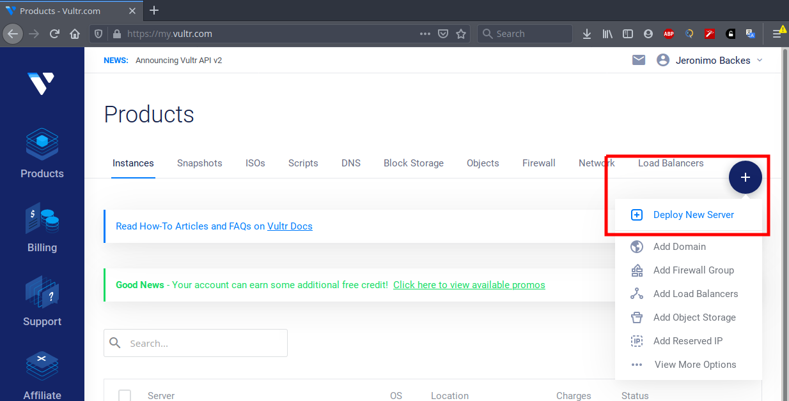
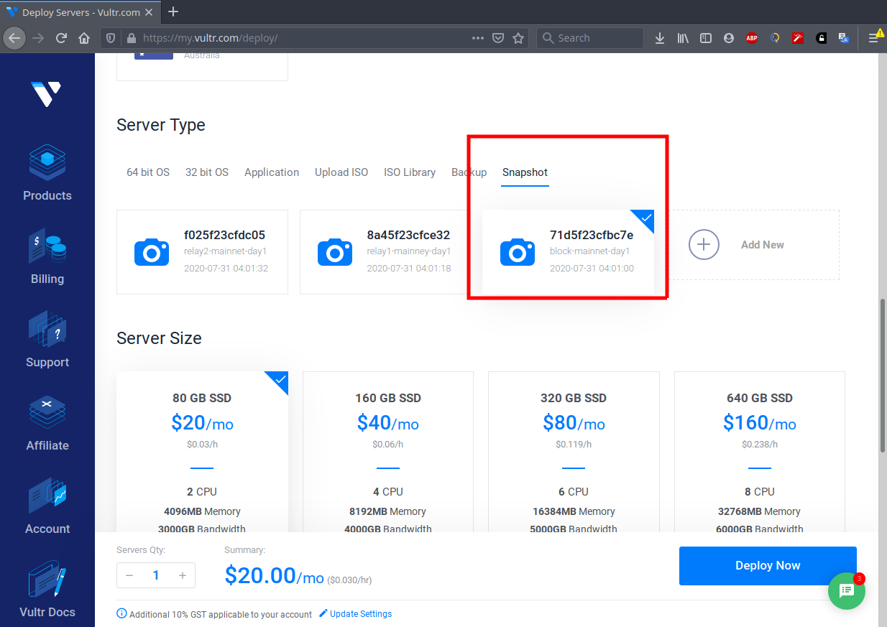
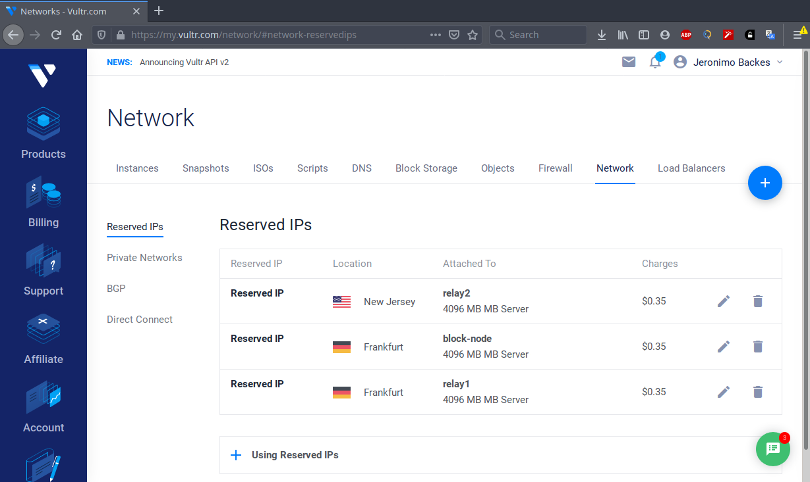
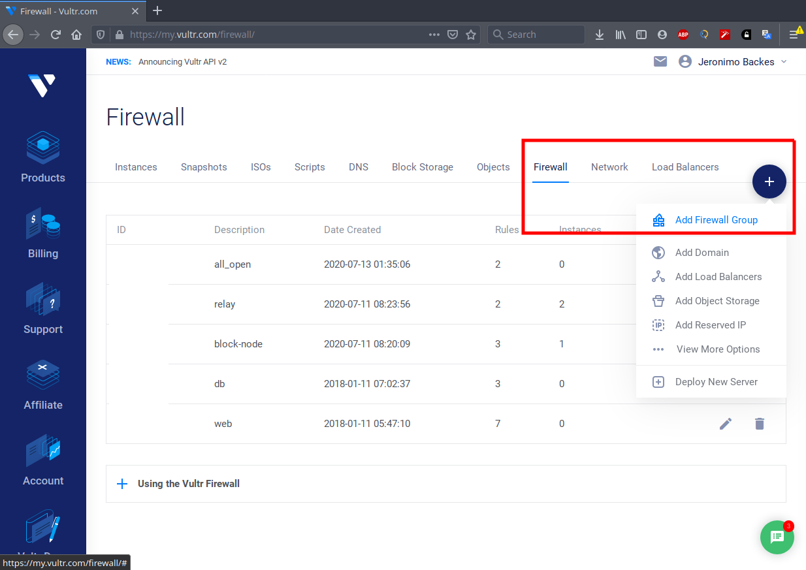
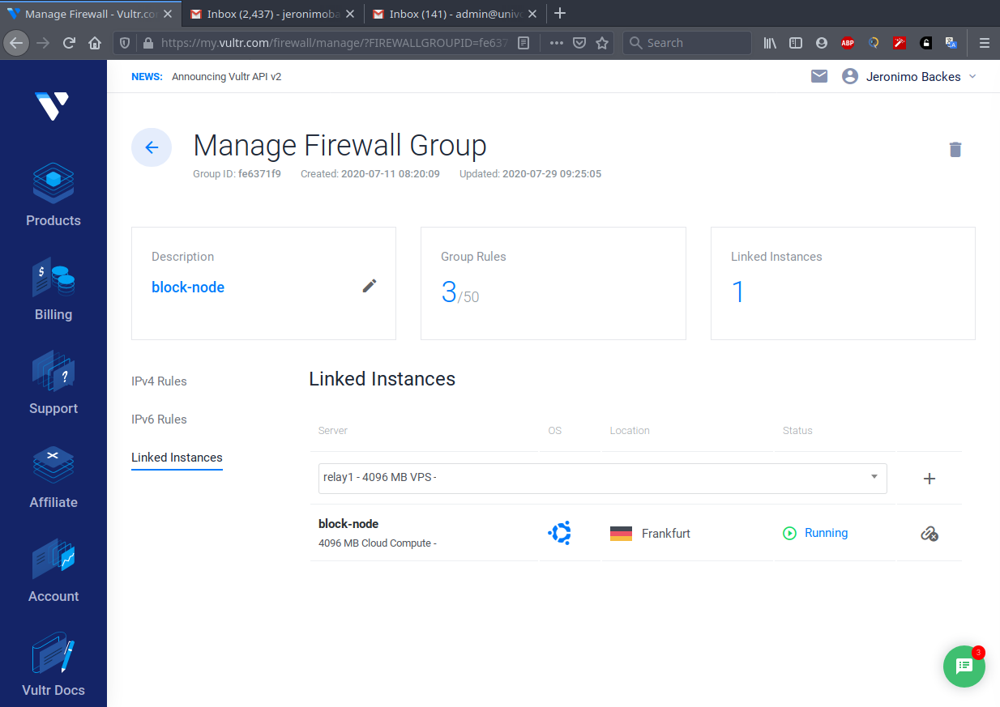

This is a step by step guide on how you could setup a staking pool using [Vultr](https://www.vultr.com/?ref=7304867).

Many of the steps listed below (such as enabling swap and google authenticator) will work 
on pretty much any other VPS or in your own local server, provided it runs Ubuntu Linux.

A LOT of the stuff in this guide has been adapted from the 
instructions provided by the excellent guide by [CoinCashew](https://www.coincashew.com/coins/overview-ada/guide-how-to-build-a-haskell-stakepool-node)

This guide is essentially a writeout of the commands I did to create the **SHOP** pool. If
you follow it blindly you will end up with the same setup I have. Adapt to your needs.

This guide is written in simple `.md` files. I suggest you to download the `.md` files
and replace all placeholders that exist in the commands presented here.

From your favorite editor, run a Search+Replace and every single command should just work<sup>TM</sup>:
```
# your username in the server
<USER>

# after you deploy your relay server
<YOUR_RELAY_IP_ADDRESS>
<YOUR_RELAY_PRIVATE_IP>

# after you deploy your block node server
<YOUR_BLOCK_NODE_IP_ADDRESS>
<YOUR_BLOCK_NODE_PRIVATE_IP>
```

# Setting up:
First create ONE instance on [Vultr](https://www.vultr.com/?ref=7304867). Once 
you create your account, click the "deploy" button. 

Select `Cloud Compute`. The server location is irrelevant.

Server type: `64 bit OS`
Choose: `Ubuntu 20.04 x64`

Select the 3rd server size which costs $20/month, it has the MINIMUM configuration to run a stake pool (you can choose something better if you want): 

```
Disk size: 80GB SSD
2 CPU
4GB of memory
```

On section "additional features", tick `Enable Private networking`

On section SSH keys, add your SSH key. If you don't have one, follow the vultr guide on [Creating an SSH key on Linux](https://www.vultr.com/docs/how-do-i-generate-ssh-keys/)

Set the server hostname and label to `relay1`

Leave everything else untouched.

Click `deploy now` and wait for the instance to be ready.

Once done, the menu "Products" will show you the list of servers, like below:


Click on your server, and copy the IP address. Also take note of
the root password.

 
 
From the terminal on your local desktop, SSH into the server:

```
ssh -A root@<YOUR_RELAY_IP_ADDRESS>
```

Create your user:
```
adduser <USER>

# enable sudo for user
usermod -aG sudo <USER>

# become the new user
su - <USER>
```

Add a SSH key:

```
# run this from your pc. It will install your SSH key in the server
ssh-copy-id <USER>@<YOUR_RELAY_IP_ADDRESS> 

# Try loggin into the server:
ssh -A <USER>@<YOUR_RELAY_IP_ADDRESS>
```

## Securing your server

We are going to setup google authenticator to make it much harder to get into your server.
I highly recommed it because if someone installs a keylogger on your computer, 
they won't be able to log into your server knowing just your password.

The first step is to disable password authentication:

```
sudo nano /etc/ssh/sshd_config

#Search for the following keys and make sure they have the following values.
PasswordAuthentication no
PubkeyAuthentication yes
ChallengeResponseAuthentication no

#Save and restart the SSH daemon
sudo systemctl reload sshd
```

Open a new terminal and try to login into the server:

```
ssh -A <USER>@<YOUR_RELAY_IP_ADDRESS>
```

Install google authenticator:
```
sudo apt-get install libpam-google-authenticator
google-authenticator
```


Say yes to everything and save the scratch codes.

```
#Force users to provide login with google auth
sudo nano /etc/pam.d/common-auth

#Add this line to the end of the file
auth required pam_google_authenticator.so

sudo nano /etc/ssh/sshd_config

#Change this line
ChallengeResponseAuthentication yes

#Save and restart
sudo systemctl restart sshd.service
```

Try logging in again from another terminal just to make sure you didn't lock yourself out.
```
ssh -A <USER>@<YOUR_RELAY_IP_ADDRESS>
```

Then proceed:

```
sudo nano /etc/ssh/sshd_config

#Add the following
UsePAM yes
AuthenticationMethods publickey,keyboard-interactive
```

Finally:

```
sudo nano /etc/pam.d/sshd

#add this line to the top of the file:
auth [success=done new_authtok_reqd=done default=die] pam_google_authenticator.so

#Comment this line by adding a # in front of @include common-auth
#@include common-auth

#Save and restart again.
sudo systemctl restart sshd.service
```

Logging into a new SSH session should now ask for the verification code.

```
ssh -A <USER>@<YOUR_RELAY_IP_ADDRESS>
```

Lock the root account:

```
 sudo  usermod -p '*' root
```

Install fail2ban to block suspicious IPs

```
sudo apt-get install fail2ban
```

## Private IP setup

Make sure the network interface associated with the private IP is up:

```
ip addr
```

You should see your private IP associated with a network interface.

If you can't find it check the VPS instructions. In Vultr, 
you need create the required configuration, e.g. `/etc/netplan/10-ens7.yaml`, which should contain something like this:

```
network:
  version: 2
  renderer: networkd
  ethernets:
    ens7:
      mtu: 1450
      dhcp4: no
      addresses: [<YOUR_RELAY_PRIVATE_IP>/20]
```

For each make sure to set the hostname:

```
sudo nano /etc/hostname
sudo nano /etc/hosts
sudo reboot
```

Once done, restart the server.

Later, when you start more instances for block node and additional relays, come back here to update the local IP and hostname.


## Install dependencies:

```
sudo apt-get update -y
sudo apt-get install build-essential pkg-config libffi-dev libgmp-dev libssl-dev libtinfo-dev libsystemd-dev zlib1g-dev make g++ tmux git jq wget libncursesw5 libtool autoconf -y
```

Install cabal:
```
cd
wget https://downloads.haskell.org/~cabal/cabal-install-3.2.0.0/cabal-install-3.2.0.0-x86_64-unknown-linux.tar.xz
tar -xf cabal-install-3.2.0.0-x86_64-unknown-linux.tar.xz
rm cabal-install-3.2.0.0-x86_64-unknown-linux.tar.xz cabal.sig
mkdir -p ~/.local/bin
mv cabal ~/.local/bin/
export PATH="~/.local/bin:$PATH"


# add that last command to your user's .bashrc file:
nano ~/.bashrc 

# paste that to the end of that file
export PATH="~/.local/bin:$PATH"
export PATH="~/.cabal/bin:$PATH"
export CARDANO_NODE_SOCKET_PATH=~/cardano-node/db/node.socket
export NODE_HOME=$HOME/cardano-node

# save and run
source ~/.bashrc

#do the same thing again for ~/.profile:
nano ~/.profile 
export PATH=~/.local/bin:$PATH
export PATH=~/.cabal/bin:$PATH
export CARDANO_NODE_SOCKET_PATH=~/cardano-node/db/node.socket

# save and run
source ~/.profile

# update cabal
cabal update

# edit config 
nano ~/.cabal/config

# add this line and save.
overwrite-policy: always
```


Download and install GHC:

```
wget https://downloads.haskell.org/~ghc/8.6.5/ghc-8.6.5-x86_64-deb9-linux.tar.xz
tar -xf ghc-8.6.5-x86_64-deb9-linux.tar.xz
rm ghc-8.6.5-x86_64-deb9-linux.tar.xz
cd ghc-8.6.5
./configure
sudo make install
cd ..
```

Install Libsodium

```
git clone https://github.com/input-output-hk/libsodium
cd libsodium
git checkout 66f017f1
./autogen.sh
./configure
make
sudo make install

nano ~/.bashrc 
# add the following lines
export LD_LIBRARY_PATH="/usr/local/lib:$LD_LIBRARY_PATH"
export PKG_CONFIG_PATH="/usr/local/lib/pkgconfig:$PKG_CONFIG_PATH"

#save and run
source ~/.bashrc
cd..
```

Download the source code for cardano-node

```
git clone https://github.com/input-output-hk/cardano-node.git
cd cardano-node
git fetch --all --tags
git tag
git checkout tags/1.18.0
```

Build the node (it takes a while to build)

```
cabal build all

# remove the db folder of older installation.
rm -rf ~/cardano-node/db

# Copy the executables files to the .local/bin directory. Replace the <TAGGED VERSION> place holder with your targeted version:
# cp -p dist-newstyle/build/x86_64-linux/ghc-8.6.5/cardano-node-<TAGGED VERSION>/x/cardano-node/build/cardano-node/cardano-node ~/.local/bin/
# cp -p dist-newstyle/build/x86_64-linux/ghc-8.6.5/cardano-cli-<TAGGED VERSION>/x/cardano-cli/build/cardano-cli/cardano-cli ~/.local/bin/
# cp -p dist-newstyle/build/x86_64-linux/ghc-8.6.5/cardano-node-<TAGGED VERSION>/x/chairman/build/chairman/chairman ~/.local/bin/

# For the current 1.18.0 version:

cp -p dist-newstyle/build/x86_64-linux/ghc-8.6.5/cardano-node-1.18.0/x/cardano-node/build/cardano-node/cardano-node ~/.local/bin/
cp -p dist-newstyle/build/x86_64-linux/ghc-8.6.5/cardano-cli-1.18.0/x/cardano-cli/build/cardano-cli/cardano-cli ~/.local/bin/
cp -p dist-newstyle/build/x86_64-linux/ghc-8.6.5/cardano-cli-1.18.0/x/cardano-cli/build/cardano-cli/cardano-cli ~/.local/bin/
cp -p dist-newstyle/build/x86_64-linux/ghc-8.6.5/cardano-node-1.18.0/x/chairman/build/chairman/chairman ~/.local/bin/
```

Configure the node:
```
mkdir ~/config
cd ~/config

# Download the config files
wget https://hydra.iohk.io/job/Cardano/cardano-node/cardano-deployment/latest-finished/download/1/mainnet-config.json
wget https://hydra.iohk.io/job/Cardano/cardano-node/cardano-deployment/latest-finished/download/1/mainnet-shelley-genesis.json
wget https://hydra.iohk.io/job/Cardano/cardano-node/cardano-deployment/latest-finished/download/1/mainnet-byron-genesis.json
wget https://hydra.iohk.io/job/Cardano/cardano-node/cardano-deployment/latest-finished/download/1/mainnet-topology.json
```

Create node start script (this tutorial uses port 3001 for everything):

```
cd
nano ~/run.sh

#add this (with export and absolute path, otherwise the service won't run):

#!/bin/sh

export LD_LIBRARY_PATH="/usr/local/lib:$LD_LIBRARY_PATH"

/home/<USER>/.local/bin/cardano-node run \
   --topology ~/config/mainnet-topology.json \
   --database-path ~/cardano-node/db \
   --socket-path ~/cardano-node/db/node.socket \
   --host-addr 0.0.0.0 \
   --port 3001 \
   --config ~/config/mainnet-config.json

#save and run:
sh run.sh
```

If you get a `DbMarkerError`, stop any processes and remove the `db` folder:

```
rm -rf ~/cardano-node/db
```

Check whether node is syncing:
```
cardano-cli shelley query tip --mainnet
```

You should see something like this:

```
{
    "blockNo": 4509759,
    "headerHash": "2ca97ff0ad9b76e3f76afea6be04d8cdf6f7b198564cdc0e9cbfa6a2a1f3ca23",
    "slotNo": 4878240
}
```

At the beginning, every time you execute this command, the value of `blockNo` should be increasing.
You can watch the logs with:

```
journalctl --unit=cardano --since=today -f -o short 
```

Configure the node to view the nice UI (which I don't find very helpful, but most people seem to like. I prefer ugly log messages):
```
nano ~/config/mainnet-config.json

#set these
  "TraceBlockFetchDecisions": true,
  "ViewMode": "LiveView"
```

## Enable swap

Vultr nodes come without swap - the same applies for most VPS providers. To prevent any
out of memory issues, create a swap file which will be used to store data that cannot be held 
in RAM with the following commands:

```
#create a 4GB file named 'swapfile' on the root of the filesystem:
sudo dd if=/dev/zero of=/swapfile count=4096 bs=1M

#setup the swapfile and activate the system to use it
sudo chmod 600 /swapfile
sudo mkswap /swapfile
sudo swapon /swapfile

# Enable swap on reboot:
sudo nano /etc/fstab

# Add this line:
/swapfile   none    swap    sw    0   0

# Save and exit
``` 

## Enable the node to run as a service
```
sudo nano /etc/systemd/system/cardano.service

[Unit]
Description=Cardano node
StartLimitIntervalSec=0
After=network.target

[Service]
Type=simple
Restart=on-failure
RestartSec=10
User=<USER>
WorkingDirectory=/home/<USER>
ExecStart=/bin/sh run.sh
SuccessExitStatus=143
StandardOutput=syslog+console
StandardError=syslog+console

[Install]
WantedBy=multi-user.target


# save and execute
sudo systemctl daemon-reload
sudo systemctl enable cardano.service
sudo systemctl start cardano
sudo systemctl status cardano

# check the service status 
sudo journalctl -u cardano
sudo journalctl -xe

```

Now if you restart the server, the node will automatically start with it. If the
node crashes, it will also be restarted automatically for you.

Once everything is running as expected, create a snapshot of this server in [Vultr](https://www.vultr.com/?ref=7304867):



This will take a while to complete. Walk your dog then come back later.

Once it completes you can deploy a new server.



On the server deploy screen, under the "server type" section, choose your snapshot:



Again, select `enable private networking`.

Set the hostname and server label to `block-node`.
 
Click "deploy now" and walk your dog again. This will take a long while.
 
After this process finishes, you will see the server on the list of instances.
Copy its IP and you can straight away SSH into it:
 
`ssh -A root@<YOUR_BLOCK_NODE_IP_ADDRESS>`

Repeat the steps mentioned in the [Private IP setup] mentioned earlier (update local IP address, the hostname, then restart the server)

> If you want more relay nodes, don't use this snapshot again. Configure one relay 
> node fully, then create a "more ready" snapshot from which you can restore,
> then the only work left is to update the topology files only.

# Reserve your server IPs so they won't change.

On your [Vultr](https://www.vultr.com/?ref=7304867)  dashboard, click "Network", then "Reserved IPs"
 


You can usually reserve the IPs currently assigned to your servers. Just confirm and proceed. 

## Firewall setup

On your [Vultr](https://www.vultr.com/?ref=7304867) dashboard, click "add firewall group":



Name it "relay", add the following rules for your relay node(s):

Allow SSH only from your desktop computer (or more computers you might want to use), and 
open port 3001 to the world.
```
ACCEPT - SSH - 22   - YOUR HOME IP
ACCEPT - TCP - 3001 - 0.0.0.0/0
```


Create another firewall group named "block-node", add the following rules for your relay node(s):

Again, allow SSH only from your desktop computer (or more computers you might want to use):
```
ACCEPT - SSH - 22   - YOUR HOME IP
```

You don't need to include the TCP connection on port 3001 for the Private IP address of your relay node(s)
in the same region as your block node because private network traffic is not filtered by the Vultr firewall.

If you have a relay node that's deployed in a different region than your block node, it won't be able to 
reach it over the private network. In that case add the public IP of your relay node.

With the rules set, click on "linked instances" and add your relay node to firewall group "relay",
and your block node instance to firewall group "block-node":



Give it some minutes for the changes to propagate, then test if the ports you need are open

```
#from your home desktop, as everyone should be able to reach your relay:
nc -zvw3 <YOUR_RELAY_IP_ADDRESS> 3001

#from your block-node:
nc -zvw3 <YOUR_RELAY_PRIVATE_IP> 3001
nc -zvw3 <YOUR_RELAY_IP_ADDRESS> 3001

# from your relays:
# if in the same network
nc -zvw3 <YOUR_BLOCK_NODE_PRIVATE_IP> 3001

# if not in the same network
nc -zvw3 <YOUR_BLOCK_NODE_IP_ADDRESS> 3001

```

These commands will only work if the cardano-node process is running, which it should since it's a service that's enabled at startup

# Block node-specific setup 

Proceed to the [block node setup](./block_node_setup.md) guide to configure your block-producing node, then come back again.

# Topology

Once everything is ready, you can finally configure the topology of your network. On each server you
have, edit the topology configuration with:

```
nano ~/config/mainnet-topology.json 
```

### BLOCK PRODUCER TOPOLOGY:

Private IP of relay1 and public IP of relay2

```
{
  "Producers": [
    {"addr": "<YOUR_RELAY1_IP_ADDRESS>","port": 3001,"valency": 2},
    {"addr": "<YOUR_RELAY2_IP_ADDRESS>","port": 3001,"valency": 2}
  ]
}
```

### RELAY1 TOPOLOGY:

Private IP of block node, and public IP of relay2

```
{
  "Producers": [
    {"addr": "<YOUR_BLOCK_NODE_PRIVATE_IP>","port": 3001,"valency": 2},
    {"addr": "<YOUR_RELAY2_IP_ADDRESS>","port": 3001,"valency": 2},
    {"addr": "relays-new.cardano-mainnet.iohk.io","port": 3001,"valency": 2}
  ]
}
```

### RELAY2 TOPOLOGY:

Public IP of block node, and public IP of relay1. 

```
{
  "Producers": [
    {"addr": "<YOUR_BLOCK_NODE_IP_ADDRESS>","port": 3001,"valency": 2},
    {"addr": "<YOUR_RELAY1_IP_ADDRESS>","port": 3001,"valency": 2},
    {"addr": "relays-new.cardano-mainnet.iohk.io","port": 3001,"valency": 2}
  ]
}
```

You can also run the [topology updater script](./topology_updater.md) for each relay node you have.

# Useful commands

## Check logs
```
# -f will keep following the log and print any new messages
# -o configures the ouptut format (short, verbose, json, json-pretty, cat)
journalctl --unit=cardano --since=today -f -o short 

#yesterday logs
journalctl --unit=cardano --since=yesterday

#logs within a given period.
journalctl --unit=cardano --since='2020-07-29 00:00:00' --until='2020-07-29 12:00:00'
```

### Checking Stake pool Rewards
```
cardano-cli shelley query stake-address-info --address $(cat ~/pool-keys/stake.addr)  --mainnet
```

### Check pledge address balance
```
cardano-cli shelley query utxo --address $(cat ~/pool-keys/payment.addr) --mainnet
```

### Check delegators

Copy the [getDelegators.sh](scripts/getDelegators.sh) script to your block producing node, make it executable with `chmod +x getDelegators.sh`, then run:

```
cardano-cli shelley stake-pool id --verification-key-file ~/pool-keys/node.vkey > /tmp/stakepoolid.txt
cat /tmp/stakepoolid.txt
./getDelegators.sh $(cat /tmp/stakepoolid.txt)
```

### Send money out of your pledge address:

Execute all commands listed in the [Send simple payment](./send_simple_payment.md), in order. Ugly, but works.
